[![LinkedIn][linkedin-shield-lapissoft]][linkedin-url-lapissoft]
[![Facebook-Page][facebook-shield-lapissoft]][facebook-url-lapissoft]
[![Youtube][youtube-shield-lapissoft]][youtube-url-lapissoft]

## Visit Us [Lapis Soft](http://www.lapissoft.com)

### AWS Certified DevOps Engineer Professional

This is designed for individuals who have experience working in a DevOps role and using AWS services. This certification validates your knowledge and skills in various areas related to implementing and managing continuous delivery systems and methodologies on the AWS platform. Key topics covered in the AWS Certified DevOps Engineer – Professional exam include:

- ***SDLC Automation:*** Implementing and managing continuous delivery systems and methodologies.
- ***Configuration Management and Infrastructure as Code (IaC):*** Implementing and managing the deployment pipeline, including infrastructure as code (IaC).
- ***Monitoring and Logging:*** Implementing monitoring and logging systems on AWS.
- ***Policies and Standards Automation:*** Implementing systems that are highly available, scalable, and self-healing on the AWS platform.
- ***Incident and Event Response:*** Designing, managing, and maintaining tools to automate operational processes.
To prepare for the exam, it's recommended to have hands-on experience with various AWS services and understand how to design, manage, and maintain tools for automating operational processes. Additionally, reviewing the official exam guide provided by AWS, along with relevant AWS documentation and whitepapers, can help you prepare effectively.

### Cloud Computing
Cloud computing is the on-demand delivery of compute power, database, storage, applications, and other IT resources through a cloud services platform via the internet with pay-as-you-go pricing.

#### [Types of Cloud Computing Deployment Models](https://aws.amazon.com/types-of-cloud-computing/)
- [Private Cloud](https://aws.amazon.com/what-is/private-cloud/#:~:text=A%20private%20cloud%20is%20a,the%20control%20of%20one%20organization.)
  - This service used by a single organization, not exposed to public.
  - Complete self control
  - Secure for senserive applications.
  - Fulfill specified requirements.
  - For example [RackSpace](https://www.rackspace.com), [Hewlett Packard Enterprise (HPE)](https://www.hpe.com/emea_europe/en/home.html) and so on.
- Public Cloud
  - Cloud resources owned and operated by a third- party cloud service provider delivered over the Internet.
  - [Six Advantages](https://docs.aws.amazon.com/whitepapers/latest/aws-overview/six-advantages-of-cloud-computing.html) of Cloud Computing.
    - Trade fixed expense (Capital Expense - ***CapEx***) for variable expense (Operational Expense - ***OpEx***).
      - Pay on demand: Don't own hardware.
      - Reduce Total Cost of Ownership (TCO) & Operational Expense (OpEx).
    - Benefit from massive economies of scale
      - Prices are reduced as AWS is more efficient due to large scale
    - Stop guessing capacity
      - Scale based on actual measured usage
    - Increase speed and agility
    - Stop spending money running and maintaining data centers
    - Go global in minutes
  - For example AWS, Google Cloud Platform (GCP) & Microsoft Azure.
- [Hybrid Cloud](https://aws.amazon.com/hybrid/)
  - Keep some servers on premises and extend some capabilities to the Cloud
  - Control over sensitive assets in your private infrastructure
  - Flexibility and cost- effectiveness of the public cloud
  - For example, On-premises with Public cloud.

#### The Five Characteristics of Cloud Computing
1. On-demand self service:
   Users can provision resources and use them without human interaction from the service provider
2. Broad network access:
   Resources available over the network, and can be accessed by diverse client platforms
3. Multi-tenancy and resource pooling:
   Multiple customers can share the same infrastructure and applications with security and privacy.
   Multiple customers are serviced from the same physical resources
4. Rapid elasticity and scalability:
   Automatically and quickly acquire and dispose resources when needed
   Quickly and easily scale based on demand
5. Measured service:
   Usage is measured, users pay correctly for what they have used

#### Problems solved by the Cloud
- Flexibility: change resource types when needed
- Cost-Effectiveness: pay as you go, for what you use
- Scalability: accommodate larger loads by making hardware stronger or adding additional nodes
- Elasticity: ability to scale out and scale-in when needed
- High-availability and fault-tolerance: build across data centers
- Agility: rapidly develop, test and launch software applications

#### [Types of Cloud Computing Model](https://aws.amazon.com/types-of-cloud-computing/)
- Infrastructure as a Service (IaaS)
  - Provide building blocks for cloud IT
  - Provides networking, computers, data storage space
  - Highest level of flexibility
  - Easy parallel with traditional on-premises IT
  - For example
    - Amazon EC2 (on AWS)
    - GCP, Azure, Rackspace, Digital Ocean, Linode
- Platform as a Service (PaaS)
  - Removes the need for your organization to manage the underlying infrastructure
  - Focus on the deployment and management of your applications
  - For example
    - Elastic Beanstalk (on AWS)
    - Heroku, Google App Engine (GCP), Windows Azure (Microsoft)
- Software as a Service (SaaS)
  - Completed product that is run and managed by the service provider
  - For example
    - Many AWS services (ex: Rekognition for Machine Learning)
    - Google Apps (Gmail), Dropbox, Zoom
  
##### Cloud Computing Model
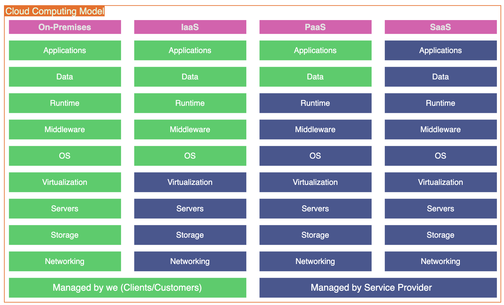

#### Price of Cloud
AWS has 3 pricing fundamentals, following the pay-as-you-go pricing model
1. Compute: Pay for compute time
2. Storage: Pay for data stored in the Cloud
3. Data transfer out of the Cloud: Data transfer IN is free
Its the expensive issue then traditional IT

#### AWS Availability Zones
- Each region has many availability zones
  - Usually 3, Minimum 3, Maximum 6
  - Example: ap-southeast-2a, ap-southeast-2b, ap-southeast-2c
- Each availability zone (AZ) is one or more discrete data centers with redundant power, networking, and connectivity
- They’re separate from each other, so that they’re isolated from disasters
- They’re connected with high bandwidth, ultra-low latency networking


#### Visit of the AWS Console
- AWS has Global Services:
  - Identity and Access Management (IAM)
  - Route 53 (DNS service)
  - CloudFront (Content Delivery Network)
  - WAF (Web Application Firewall)
- Most AWS services are Region-scoped:
  - Amazon EC2 (Infrastructure as a Service)
  - Elastic Beanstalk (Platform as a Service)
  - Lambda (Function as a Service)
  - Rekognition (Software as a Service)
- See here [Region Services:](https://aws.amazon.com/about-aws/global-infrastructure/regional-product-services/)

#### [Shared Responsibility Model](https://aws.amazon.com/compliance/shared-responsibility-model/)
Security and Compliance is a shared responsibility between AWS and the customer. This shared model can help relieve the customer’s operational burden as AWS operates, manages and controls the components from the host operating system and virtualization layer down to the physical security of the facilities in which the service operates. The customer assumes responsibility and management of the guest operating system (including updates and security patches), other associated application software as well as the configuration of the AWS provided security group firewall. 


###  [Identity & Access Management (IAM)](https://docs.aws.amazon.com/IAM/latest/UserGuide/introduction.html)
AWS Identity and Access Management (IAM) is a web service that helps you securely control access to AWS resources. With IAM, you can centrally manage permissions that control which AWS resources users can access. Features of Identity and Access Management;
- It is global service
- Root account created by default, shouldn’t be used or shared
- Users are people within your organization, & can be grouped
- Groups only contain users, not other groups
- Users don’t have to belong to a group, and user can belong to multiple groups
- For an Example of group as follows


#### Why use group
- The policies define the permission to the users.
- Users or Groups can be assigned JSON documents called policies
- These policies define the permissions of the users
- In AWS you apply the least privilege principle: don’t give more permissions than a user needs
- [Policies Structure](https://docs.aws.amazon.com/IAM/latest/UserGuide/access_policies.html)

#### [Policies Structure](https://docs.aws.amazon.com/IAM/latest/UserGuide/intro-structure.html)
***Principal:***
A principal is a human user or workload that can make a request for an action or operation on an AWS resource. After authentication, the principal can be granted either permanent or temporary credentials to make requests to AWS, depending on the principal type. IAM users and root user are granted permanent credentials, while roles are granted temporary credentials. As a best practice, we recommend that you require human users and workloads to access AWS resources using temporary credentials.
```JSON
{
  "Version": "2024-01-30",              // policy language version, always include
  "Id": "Account-Permission"            // an identifier for the policy (optional)
  "Statement": [                        // one/more individual statements (required)
    {
      "Sid": "FirstStatement",          // an identifier for the statement (optional)
      "Effect": "Allow",                // whether the statement allows/denies access (Allow, Deny)
      "Action": ["iam:ChangePassword"], // list of actions this policy allows/denies
      "Resource": "*"                   // list of resources to which the actions applied to
    },
    {
      "Sid": "SecondStatement",
      "Effect": "Allow",
      "Action": [
        "s3:List*",
        "s3:Get*"
      ],
      "Resource": [
        "arn:aws:s3:::confidential-data",
        "arn:aws:s3:::confidential-data/*"
      ],
      "Condition": {"Bool": {"aws:MultiFactorAuthPresent": "true"}} // conditions for when this policies in effect  (optional)
    }
  ]
}

```
#### Create IAM user in Hands on Class.
- Go the IAM section & press 'Create User'.
- Give the user name (JakirIam) as you like.
- Select the user type
  - Specify a user in Identity Center (Recommended)
  - I want to create an IAM user (selected)
  - Give the password as you like
- Press Next
- Create user group including define the permissions.
- Give the tag name (optional)
- Download credential csv file
- IAM user created.
- Create Access keys (Access & Secret Access key)

#### AWS CLI Configuration
- Control multiple AWS services from this command line.
- How to [Install?](https://docs.aws.amazon.com/cli/latest/userguide/getting-started-install.html)
- Let's me check `aws --version`
- If its okay then we will see `aws-cli/2.15.4 Python/3.11.6 Darwin/23.2.0 exe/x86_64 prompt/off`
- Configuration using security credential
 - Go to AWS Management Console > Services > IAM
 - Select the IAM User Name: Your User Name [_**NB**_: You must use IAM's Information only not Root User]
 - Click on `Security credentials`
 - Click on `Create access key`
 - Copy Access ID & Secret access key
 - Go to your Terminal and implement as below format
 - `aws configure`
 - AWS Access Key ID [None]: Put your ID here and press Enter.
 - AWS Secret Access Key [None]: Put your secret key here and press Enter
 - Default region name [None]: us-east-1
 - Default output format [None]: json
- Let's me check whether the configuration is done.
 - `aws ec2 describe-vpcs`
 - If it is done then we will see the details of the default vpc.

#### Users access types
To access AWS, you have three options:
 - AWS Management Console (protected by password + MFA)
   - Access Keys are generated through the AWS Console
 - AWS Command Line Interface (CLI): protected by access keys
   - Access Key ID ~= username
   - Secret Access Key ~= password
 - AWS Software Developer Kit (SDK)- for code: protected by access keys
   - Language-specific APIs (set of libraries)
   - Enables you to access and manage AWS services programmatically
   - Embedded within your application
   - Supported SDKs (JavaScript, Python, PHP, .NET, Ruby, Java, Go, Node.js, C++)
   - Mobile SDKs (Android, iOS, …)
   - IoT Device SDKs (Embedded C, Arduino, …)
   - Example: AWS CLI is built on AWS SDK for Python

#### IAM Roles for Services
Some AWS service will need to perform actions on your behalf
 - To do so, we will assign permissions to AWS services with IAM Roles
 - Common roles: 
 - EC2 Instance Roles
   - Lambda Function Roles
   - Roles for CloudFormation

#### IAM Security Tools
- IAM Credentials Report (account-level)
  A report that lists all your account's users and the status of their various credentials
- IAM Access Advisor (user-level)
  - Access advisor shows the service permissions granted to a user and when those services were last accessed.
  - You can use this information to revise your policies.

#### Shared Responsibility Model of IAM
| AWS (Provider)                           | User                                                     |
| :--------------------------------------- | :------------------------------------------------------- |
| Infrastructure (global network security) | Users, Groups, Roles, Policies management and monitoring |
| Configuration and vulnerability analysis | Enable MFA on all accounts                               |
| Compliance validation                    | Rotate all your keys often                               |
| -                                        | Use IAM tools to apply appropriate permissions           |
| -                                        | Analyze access patterns & review permissions             |

### Elastic Compute Cloud (EC2 use as IaaS)
It is a very popular cloud-computing platform of AWS, that allows users to rent virtual computers on which to run their own computer applications. Its mainly consist to following resources.
- Eleatic Block Storage (EBS) > Store data on virtual drives.
- Elastic Load Balancer (ELB) > Load distribution across the EC2.
- Auto Scaling Group (ASG) > Scaling the traffic for user utility.

#### EC2 Volume & Configuration Options
- Supported OS: Linux (recommendation), Windows or Mac OS.
- How much compute power & cores (CPU).
- How much random-access memory (RAM).
- How much storage space:
  - Network Attached (EBS & EFS)
  - Hardware (EC2 Instance Store)
- Network card: speed of the card, Public IP address
- Firewall rules: security group (SG)
- Bootstrap script (configure at first launch): EC2 User Data

#### Hands On (Launching an EC2 Instance Running on Ubuntu Linux)

#### EC2 Instance Overview
As per AWS has the following naming convention: ***m5.2xlarge***
Here
- ***5*** > Generation (AWS improves them over time)
- ***m*** > Instance Class
- ***2xlarge*** > Size within the instance class

[EC2 Instance Types](https://aws.amazon.com/ec2/instance-types/?gclid=CjwKCAiAlJKuBhAdEiwAnZb7lZtz6Hg-Nr2dW7JErl0Xng7mOGfkBspN09gheGCmnx6VajROvTDejxoCc_QQAvD_BwE&trk=32f4fbd0-ffda-4695-a60c-8857fab7d0dd&sc_channel=ps&ef_id=CjwKCAiAlJKuBhAdEiwAnZb7lZtz6Hg-Nr2dW7JErl0Xng7mOGfkBspN09gheGCmnx6VajROvTDejxoCc_QQAvD_BwE:G:s&s_kwcid=AL!4422!3!536392685920!e!!g!!ec2%20instance%20types!11539707735!118057054048)

- General Purpose
  - Great for a diversity of workloads such as web servers or code repositories
  - Balance among: Compute, Memory & Networking
  - For t2.micro is a General Purpose EC2 instance

- Compute Optimized
  - Great for compute-intensive tasks that require high performance processors:
  - Batch processing workloads
  - Media transcoding
  - High performance web servers
  - High performance computing (HPC)
  - Scientific modeling & machine learning
  - Dedicated gaming servers

- Memory Optimized
  - Fast performance for workloads that process large data sets in memory
  - Use cases:
    - High performance, relational/non-relational databases
    - Distributed web scale cache stores
    - In-memory databases optimized for BI (business intelligence)
    - Applications performing real-time processing of big unstructured data

- Storage Optimized
  - Great for storage-intensive tasks that require high, sequential read and write access to large data sets on local storage
  - Use cases:
    - High frequency online transaction processing (OLTP) systems
    - Relational & NoSQL databases
    - Cache for in-memory databases (for example, Redis)
    - Data warehousing applications
    - Distributed file systems

Example (Instance Type)


#### Security Groups (SG)
- Security Groups are the fundamental of network security in AWS. Its working like as firewall.
- They control how traffic is allowed into or out of our EC2 Instances. Inbound traffic
- Security groups only contain rules
- Security groups rules can reference by IP or by security group.

Illustration shown as follows;
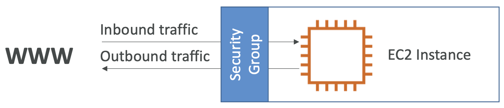

Security Groups Deeper Dive
- Security groups are acting as a “firewall” on EC2 instances
- They regulate:
  - Access to Ports
  - Authorized IP ranges – IPv4 and IPv6
  - Control of inbound network (from other to the instance)
  - Control of outbound network (from the instance to other)

Illustration shown as follows;
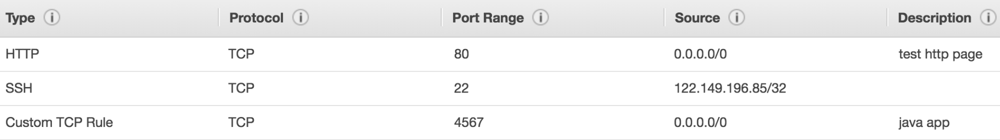

Security Group Diagram
Illustration shown as follows;
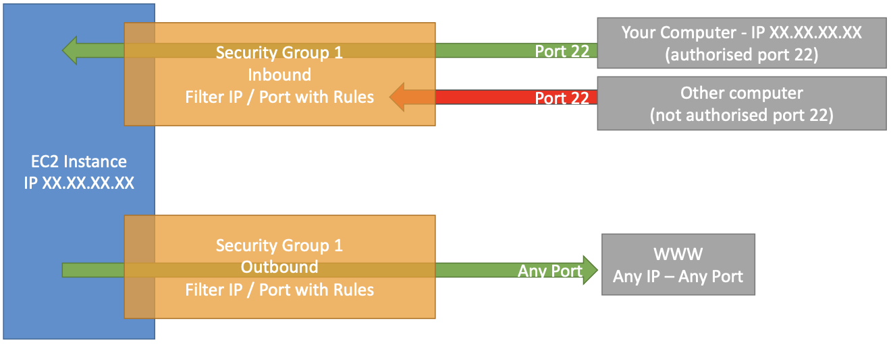

Security Groups Good to know
- Can be attached to multiple instances
- Locked down to a region / VPC combination
- Does live “outside” the EC2 – if traffic is blocked the EC2 instance won’t see it
- It’s good to maintain one separate security group for SSH access
- If your application is not accessible (time out), then it’s a security group issue
- If your application gives a “connection refused“ error, then it’s an application error or it’s not launched
- All inbound traffic is blocked by default
- All outbound traffic is authorized by default

Illustration shown as follows;
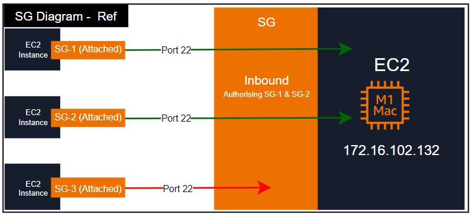

Some important Port
|  SL   | Port | Protocol                      |
| :---: | :--- | :---------------------------- |
|   1   | 21   | FTP                           |
|   2   | 22   | SSH                           |
|   3   | 22   | SFTP                          |
|   4   | 80   | HTTP                          |
|   5   | 443  | HTTPS                         |
|   6   | 3389 | Remote Desktop Protocol (RDP) |

EC2 Instances Purchasing Options
|  SL   | Instance Name         |   Period   | Description                                                |
| :---: | :-------------------- | :--------: | :--------------------------------------------------------- |
|   1   | On-Demand             | Short Time | short workload, predictable pricing, pay by second         |
|   1   | Reserved Instances    | 1-3 Years  | long workloads with flexible instances                     |
|   2   | Savings Plans         | 1-3 Years  | commitment to an amount of usage, long workload            |
|   3   | Spot Instances        | Short Time | short workloads, cheap, can lose instances (less reliable) |
|   4   | Dedicated Hosts       | Long Time  | book an entire physical server, control instance placement |
|   5   | Dedicated Instances   |    N/A     | no other customers will share your hardware                |
|   6   | Capacity Reservations |    N/A     | reserve capacity in a specific AZ for any duration         |

***Mentioned features of each instance below as follows;***
***On Demand***
- Pay for what you use:
  - Linux or Windows
    - Billing per second, after the first minute 
    - All other operating systems - billing per hour
- Has the highest cost but no upfront payment
- No long-term commitment
- Recommended for short-term and un-interrupted workloads, where you can't predict how the application will behave

***Reserved Instances***
- Up to 72% discount compared to On-demand
- You reserve a specific instance attributes (Instance Type, Region,Tenancy, OS)
- Reservation Period
  - 1 year (+discount) or 
  - 3 years (+++discount)
- Payment Options
  - No Upfront (+), 
  - Partial Upfront (++), 
  - All Upfront (+++)
- Reserved Instance’s Scope: Regional or Zonal (reserve capacity in an AZ)
- Recommended for steady-state usage applications (think database)
- You can buy and sell in the Reserved Instance Marketplace
- Convertible Reserved Instance
  - Can change the EC2 instance type, instance family, OS, scope and tenancy
  - Up to 66% discount

***Savings Plans***
- Get a discount based on long-term usage
  - up to 72% - same as Reserved Instance’s
  - Commit to a certain type of usage ($10/hour for 1 or 3 years)
- Usage beyond EC2 Savings Plans is billed at the On-Demand price
- Locked to a specific instance family & AWS region (e.g., M5 in us-east-1)
- Flexible across:
  - Instance Size (e.g., m5.xlarge, m5.2xlarge)
  - OS (e.g., Linux, Windows)
  - Tenancy (Host, Dedicated, Default)

***Spot Instances***
- Can get a discount of up to 90% compared to On-demand
- Instances that you can ***lose*** at any point of time if your max price is less than the current spot price
- The MOST ***cost-efficient*** instances in AWS
- Useful for workloads that are resilient to failure • Batch jobs
  - Data analysis
  - Image processing
  - Any distributed workloads
  - Workloads with a flexible start and end time
  - Not suitable for critical jobs or databases

***Dedicated Hosts***
- A physical server with EC2 instance capacity fully dedicated to your use
- Allows you address compliance requirements and use your existing server- bound software licenses (per-socket, per-core, pe—VM software licenses)
- Purchasing Options:
  - On-demand – pay per second for active Dedicated Host
  - Reserved - 1 or 3 years (No Upfront,Partial Upfront,All Upfront)
- The most expensive option
- Useful for software that have complicated licensing model (BYOL – Bring Your Own License)
- Or for companies that have strong regulatory or compliance needs

***Dedicated Instances***
- Instances run on hardware that’s dedicated to you
- May share hardware with other instances in same account
- No control over instance placement (can move hardware after Stop / Start)

|  SL   | Characteristic                                      | Dedicated Instances | Dedicated Hosts |
| :---: | :-------------------------------------------------- | :-----------------: | :-------------: |
|   1   | Enable the use of dedicated physical servers        |          x          |        x        |
|   2   | Per instance billing (subject to $2 per region fee) |          x          |        -        |
|   3   | Per host billing                                    |          -          |        x        |
|   4   | Visibility of sockets, cores, host ID               |          -          |        x        |
|   5   | Affinity between a host and instance                |          -          |        x        |
|   6   | Targeted instance placement                         |          -          |        x        |
|   7   | Automatic instance placement                        |          x          |        x        |
|   8   | Add capacity using an allocation request            |          -          |        x        |

***Capacity Reservations***
- Reserve On-Demand instances capacity in a specific AZ for any duration
- You always have access to EC2 capacity when you need it
- No time commitment (create/cancel anytime), no billing discounts
- Combine with Regional Reserved Instances and Savings Plans to benefit from billing discounts
- You’re charged at On-Demand rate whether you run instances or not
- Suitable for short-term, uninterrupted workloads that needs to be in a specific AZ

#### Shared Responsibility Model of EC2 Instance
| AWS (Provider)                           | User                                                   |
| :--------------------------------------- | :----------------------------------------------------- |
| Infrastructure (global network security) | Security Groups rules                                  |
| Isolation on physical hosts              | Operating-system patches and updates                   |
| Replacing faulty hardware                | Software and utilities installed on the EC2 instance   |
| Compliance validation                    | IAM Roles assigned to EC2 & IAM user access management |
| -                                        | Data security on your instance                         |

#### EC2 Instance Storage
***EBS Volume***
An EBS (Elastic Block Store) Volume is a network drive (i.e. not a physical drive) you can attach to your instances while they run
- It allows your instances to persist data, even after their termination
- They can only be mounted to one instance at a time (at the Certified Cloud Practitioner (CCP) level)
- They are bound to a specific availability zone
- Analogy:Think of them as a “network USB stick”
- Free tier: 30 GB of free EBS storage of type General Purpose (SSD) or Magnetic per month
- It uses the network to communicate the instance, which means there might be a bit of latency
- It can be detached from an EC2 instance and attached to another one quickly
- It’s locked to an Availability Zone (AZ)
- An EBS Volume in ***us-east-1a*** cannot be attached to ***us-east-1b***
- To move a volume across, you first need to snapshot it
- Have a provisioned capacity (size in GBs, and IOPS)
- You get billed for all the provisioned capacity
- You can increase the capacity of the drive over time

***EBS Snapshots Features***
- EBS Snapshot Archive
  - Move a Snapshot to an ”archive tier” that is 75% cheaper
  - Takes within 24 to 72 hours for restoring the archive
- Recycle Bin for EBS Snapshots
  - Setup rules to retain deleted snapshots so you can recover them after an accidental deletion
  - Specify retention (from 1 day to 1 year)

***Amazon Machine Image (AMI)***
- AMI are a customization of an EC2 instance
  - You add your own software, configuration, operating system, monitoring... 
  - Faster boot / configuration time because all your software is pre-packaged
- AMI are built for a specific region (and can be copied across regions)
- You can launch EC2 instances from:
  - A Public AMI: AWS provided
  - Your own AMI: you make and maintain them yourself
  - An AWS Marketplace AMI: an AMI someone else made (and potentially sells)

***AMI Process (from an EC2 instance)***
- Start an EC2 instance and customize it
- Stop the instance (for data integrity)
- Build an AMI – this will also create EBS snapshots 
- Launch instances from other AMIs

***EC2 Image Builder***
- Used to automate the creation ofVirtual Machines or container images
- Automate the creation, maintain, validate and test EC2 AMIs
- Can be run on a schedule (weekly, whenever packages are updated, etc...)
- Free service (only pay for the underlying resources)
Illustration shown below;
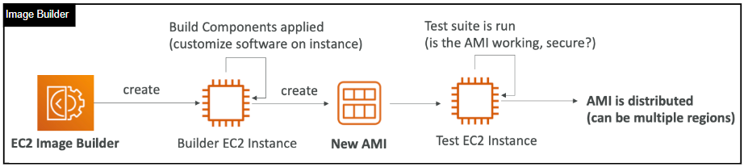

***EFS Infrequent Access (EFS-IA)***
- Managed NFS (network file system) that can be mounted on 100s of EC2
- EFS works with Linux EC2 instances in multi-AZ
- Highly available, scalable, expensive (3x gp2), pay per use, no capacity planning
- Storage class that is cost-optimized for files not accessed every day
- Up to 92% lower cost compared to EFS Standard
- EFS will automatically move your files to EFS-IA based on the last time they were accessed
- Enable EFS-IA with a Lifecycle Policy
- Example: move files that are not accessed for 60 days to EFS-IA
- Transparent to the applications accessing EFS
- cost-optimized storage class for infrequent accessed files

#### Shared Responsibility Model of Storage Volume
| AWS (Provider)                                    | User                                               |
| :------------------------------------------------ | :------------------------------------------------- |
| Infrastructure                                    | Setting up backup / snapshot procedures            |
| Replication for data for EBS volumes & EFS drives | Setting up data encryption                         |
| Replacing faulty hardware                         | Responsibility of any data on the drives           |
| Ensuring their employees cannot access your data  | Understanding the risk of using EC2 Instance Store |

***Amazon FSx***
Launch 3rd party high-performance file systems on AWS. Fully managed service
- FSx for Lustre
- FSx for Windows File Server
- FSx for NetApp ONTAP

Amazon FSx for Windows File Server
- A fully managed, highly reliable, and scalable Windows native shared file system
- Built on Windows File Server
- Supports SMB protocol & Windows NTFS
- Integrated with Microsoft Active Director y
- Can be accessed from AWS or your on-premise infrastructure
- Network File System for Windows servers

Amazon FSx for Lustre
- A fully managed, high-performance, scalable file storage for High Performance Computing (HPC)
- The name Lustre is derived from “Linux” and “cluster”
- Machine Learning, Analytics,Video Processing, Financial Modeling, ...
- Scales up to 100s GB/s, millions of IOPS, sub-ms latencies

***Elastic Load Balancing (ELB) & Auto Scaling Groups (ASG)***
Scalability & High Availability
- Scalability means that an application/system can handle greater loads by adapting. There are two kinds of scalability:
  - Vertical Scalability
  - Horizontal Scalability (= elasticity)
- Scalability is linked but different to High Availability

Vertical Scalability
- Vertical Scalability means increasing the size/capacity of the instance
- For example, your application runs on a t2.micro to t2.large
- Vertical scalability is very common for ***non distributed systems***, such as a ***database***.
- There’s usually a limit to how much you can vertically scale (hardware limit)

Horizontal Scalability
- Horizontal Scalability means increasing the number of instances/systems for your application
- Horizontal scaling implies distributed systems.
- This is very common for web applications/modern applications
- It’s easy to horizontally scale thanks the cloud offerings such as EC2

High Availability
- High Availability usually goes hand in hand with horizontal scaling
- High availability means running your application/system in at least 2 Availability Zones
- The goal of high availability is to survive a data center loss (disaster)

High Availability & Scalability For EC2
- Vertical Scaling: Increase instance size (scale up/down)
  - From: t2.nano - 0.5G of RAM, 1 vCPU - To: u-12tb1.metal – 12.3 TB of RAM, 448 vCPUs
- Horizontal Scaling: Increase number of instances (scale out/in)
  - Auto Scaling Group
  - Load Balancer
- High Availability: Run instances for the same application across multi AZ
  - Auto Scaling Group multi AZ
  - Load Balancer multi AZ

Scalability vs Elasticity (Agility)
- Scalability: ability to accommodate a larger load by making the hardware stronger (scale up), or by adding nodes (scale out)
- Elasticity: once a system is scalable, elasticity means that there will be some “auto-scaling” so that the system can scale based on the load. This is “cloud-friendly”: pay-per-use, match demand, optimize costs
- Agility: (not related to scalability - distractor) new IT resources are only a click away, which means that you reduce the time to make those resources available to your developers from weeks to just minutes.

***What is load balancing?***
- Load balancers are servers that forward internet traffic to multiple servers (EC2 Instances) downstream.
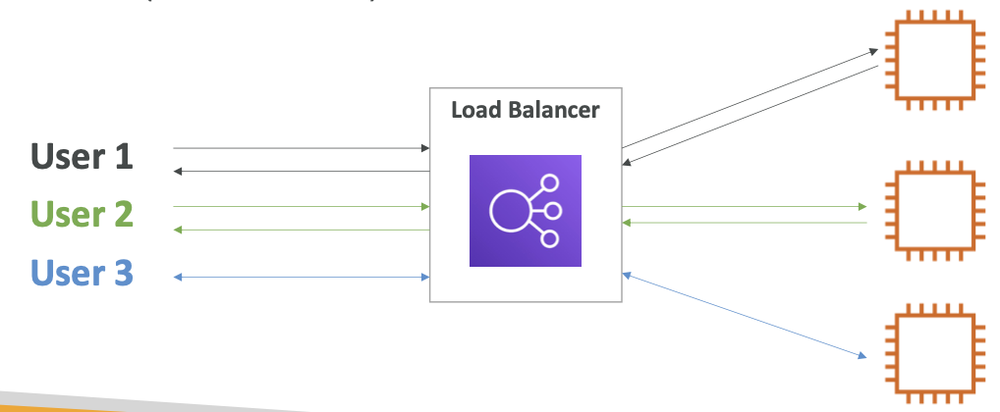

***Why use a load balancer?***
- Spread load across multiple downstream instances
- Expose a single point of access (DNS) to your application
- Seamlessly handle failures of downstream instances
- Do regular health checks to your instances
- Provide SSL termination (HTTPS) for your websites
- High availability across zones

***Why use an Elastic Load Balancer?***
- An ELB (Elastic Load Balancer) is a managed load balancer.
  - AWS guarantees that it will be working
  - AWS takes care of upgrades, maintenance, high availability
  - AWS provides only a few configuration knobs
- It costs less to setup your own load balancer but it will be a lot more effort on your end (maintenance, integrations)
- 4 kinds of load balancers offered by AWS:
  - Application Load Balancer (HTTP / HTTPS only) – Layer 7 (APS TNDP)
    - 7 Layer (Application > Presentation > Session > Transport > Network > Data Link > Physical)
  - Network Load Balancer (ultra-high performance, allows for TCP) – Layer 4
    - 4 Layer (Application > Transport > Internet > Network)
  - Gateway Load Balancer – Layer 3
  - Classic Load Balancer (retired in 2023) – Layer 4 & 7
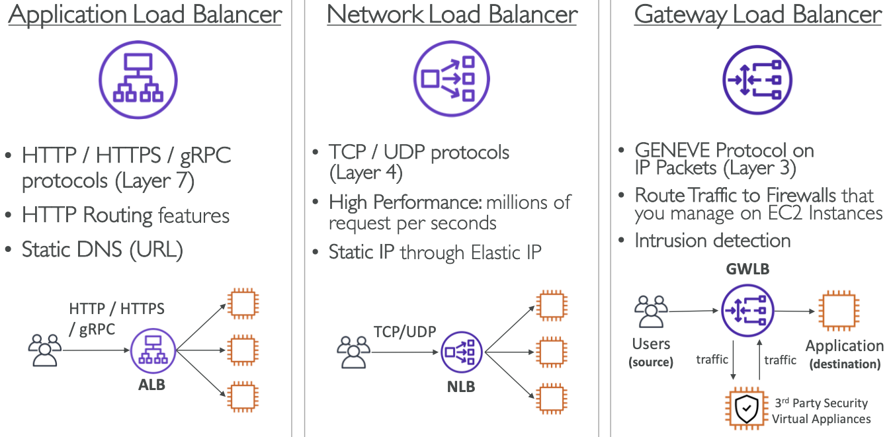

***What’s an Auto Scaling Group?***
- In real-life, the load on your websites and application can change
- In the cloud, you can create and get rid of servers very quickly
- The goal of an Auto Scaling Group (ASG) is to:
- Scale out (add EC2 instances) to match an increased load
- Scale in (remove EC2 instances) to match a decreased load
- Ensure we have a minimum and a maximum number of machines running
- Automatically register new instances to a load balancer
- Replace unhealthy instances
- Cost Savings: only run at an optimal capacity (principle of the cloud)

Auto Scaling Group
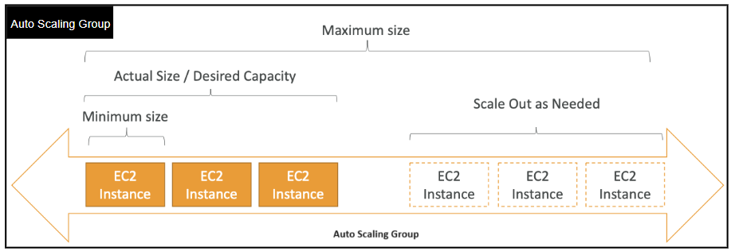

Auto Scaling Group with Load Balancer
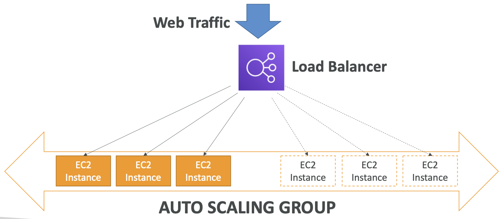

Difference between Load Balancer and Auto Scaling
|    Factors     | Load Balancer                   | Auto Scaling                    |
| :------------: | :------------------------------ | :------------------------------ |
|    Purpose     | Distribute the incoming traffic | Adjust the number of resources  |
| Algorithm used | Round-Robin algorithm or least  | Step Scaling or Target Tracking |

***Simple Storage Service (S3)***
It is an object storage service offering industry-leading scalability, data availability, security, and performance.
Uses of S3
- Backup and storage
- Disaster Recovery
- Archive
- Hybrid Cloud storage
- Application hosting
- Media hosting
- Data lakes & big data analytics
- Software delivery
- Static website

Buckets
- Amazon S3 allows people to store objects (files) in “buckets” (directories)
- Buckets must have a globally unique name (across all regions all accounts)
- Buckets are defined at the region level
- S3 looks like a global service but buckets are created in a region
  - Naming convention
  - No uppercase, No underscore
  - 3-63 characters long
  - Not an IP
  - Must start with lowercase letter or number
  - Must NOT start with the prefix xn--
  - Must NOT end with the suffix -s3alias

Objects
- Objects (files) have a Key
- The key is the FULL path:
  - s3://my-bucket/my_file.txt
  - s3://my-bucket/my_folder1/another_folder/my_file.txt
- The key is composed of prefix + object name
  - s3://my-bucket/my_folder1/another_folder/my_file.txt
- There’s no concept of “directories” within buckets (although the UI will trick you to think otherwise)
- Just keys with very long names that contain slashes (“/”)
- Object values are the content of the body:
  - Max. Object Size is 5TB (5000GB)
  - If uploading more than 5GB, must use “multi-part upload”
- Metadata (list of text key / value pairs – system or user metadata)
- Tags (Unicode key / value pair – up to 10) – useful for security / lifecycle
- Version ID (if versioning is enabled)

Security
- User-Based
  - IAM Policies – which API calls should be allowed for a specific user from IAM
- Resource-Based
  - Bucket Policies – bucket wide rules from the S3 console - allows cross account
  - Object Access Control List (ACL) – finer grain (can be disabled)
  - Bucket Access Control List (ACL) – less common (can be disabled)
- Note: an IAM principal can access an S3 object if
  - The user IAM permissions ALLOW it OR the resource policy ALLOWS it
  - AND there’s no explicit DENY
- Encryption: encrypt objects in Amazon S3 using encryption keys

S3 Bucket Policies
- JSON based policies
  - Resources: buckets and objects
  - Effect: Allow / Deny
  - Actions: Set of API to Allow or Deny
  - Principal:The account or user to apply the policy to
- Use S3 bucket for policy to:
  - Grant public access to the bucket
  - Force objects to be encrypted at upload
  - Grant access to another account (Cross Account)
Example
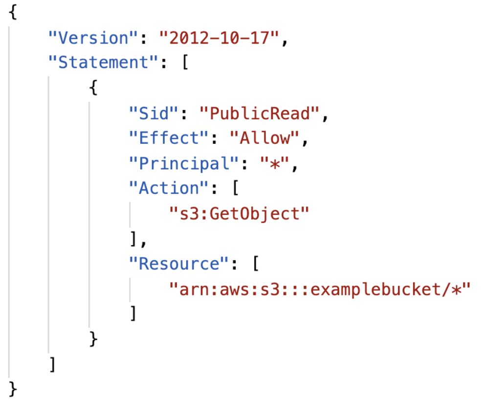
## Courtesy of Jakir

[![LinkedIn][linkedin-shield-jakir]][linkedin-url-jakir]
[![Facebook-Page][facebook-shield-jakir]][facebook-url-jakir]
[![Youtube][youtube-shield-jakir]][youtube-url-jakir]

### Have a good day, stay with me
<!-- Personal profile -->

[linkedin-shield-jakir]: https://img.shields.io/badge/linkedin-%230077B5.svg?style=for-the-badge&logo=linkedin&logoColor=white
[linkedin-url-jakir]: https://www.linkedin.com/in/jakir-ruet/
[facebook-shield-jakir]: https://img.shields.io/badge/Facebook-%231877F2.svg?style=for-the-badge&logo=Facebook&logoColor=white
[facebook-url-jakir]: https://www.facebook.com/jakir-ruet/
[youtube-shield-jakir]: https://img.shields.io/badge/YouTube-%23FF0000.svg?style=for-the-badge&logo=YouTube&logoColor=white
[youtube-url-jakir]: https://www.youtube.com/@mjakaria-ruet/featured

<!-- Company profile -->

[linkedin-shield-lapissoft]: https://img.shields.io/badge/linkedin-%230077B5.svg?style=for-the-badge&logo=linkedin&logoColor=white
[linkedin-url-lapissoft]: https://www.linkedin.com/company/lapis-soft/
[facebook-shield-lapissoft]: https://img.shields.io/badge/Facebook-%231877F2.svg?style=for-the-badge&logo=Facebook&logoColor=white
[facebook-url-lapissoft]: https://www.facebook.com/GoLapisSoft/
[youtube-shield-lapissoft]: https://img.shields.io/badge/YouTube-%23FF0000.svg?style=for-the-badge&logo=YouTube&logoColor=white
[youtube-url-lapissoft]: https://www.youtube.com/@LapisSoft/featured


