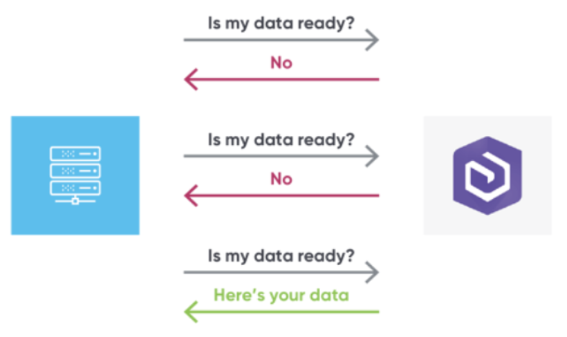

#### [Continuos Integration/Continuos Development (CI/CD)](https://docs.aws.amazon.com/whitepapers/latest/cicd_for_5g_networks_on_aws/cicd-on-aws.html)

It's a software development practice aimed at improving the quality and speed of software delivery. CI/CD pipelines are often implemented using various tools and technologies such as Jenkins, GitLab CI/CD, Travis CI, CircleCI, and others. These tools automate the stages of building, testing, and deployment, enabling development teams to release software more frequently, reliably, and efficiently. We could complete the CI/CD in seven steps (technology stack).

|  SL   | Title             | Activities                                                                                               |
| :---: | :---------------- | :------------------------------------------------------------------------------------------------------- |
|   1   | AWS CodeCommit    | Storing source code (AWS CodeCommit, GitHub, BitBucket etc.).                                            |
|   2   | AWS CodePipeline  | Automating pipeline from source code to Elastic Beanstalk & others (Orchestrate Using From Here).        |
|   3   | AWS CodeBuild     | Building & testing source code (AWS CodeBuild, Jenkins etc.).                                            |
|   4   | AWS CodeDeploy    | Deploying source code (AWS CodeDeploy, Beanstalk, EC2 Instance, On-Premises Instance, Lambda, ECS etc.). |
|   5   | AWS CodeStar      | Manage software development activities such as quick develop, build & deploy, in one place               |
|   6   | AWS Code Artifact | Store, publish, and share software packages to the end point.                                            |
|   7   | AWS CodeGuru      | Automated code reviews using Machine Learning                                                            |

#### Monitoring Tools (Events, Webhooks & Polling)

- Events: 
  You can monitor CodePipeline events in EventBridge, which delivers a stream of real-time data from your own applications, software-as-a-service (SaaS) applications, and AWS services. EventBridge routes that data to targets such as AWS Lambda and Amazon Simple Notification Service. These events are the same as those that appear in Amazon CloudWatch Events, which delivers a near real-time stream of system events that describe changes in AWS resources.

   - Event Pattern
     Each rule is expressed as an event pattern with the source and type of events to monitor, and event targets. To monitor events, you create a rule with the service you are monitoring as the event source, such as CodePipeline. For example, you can create a rule with an event pattern that uses CodePipeline as an event source to trigger the rule when there are changes in the state of a pipeline, stage, or action.
   - Targets
     The new rule receives a selected service as the event target. You might want to set up a target service to send notifications, capture state information, take corrective action, initiate events, or take other actions. When you add your target, you must also grant permissions to EventBridge to allow it to invoke the selected target service.

- Polling:
 It is when your application periodically requests updates from the server. Polling is a simple way to receive updates from a remote server. Your application sends a request to the server at regular intervals, and the server will respond with any updates that have occurred since the last request. Polling is easy to implement and can be a good choice for applications that don't need to receive updates very frequently. However, polling can be inefficient if your application needs to receive updates very quickly, or if the server is slow to respond.

  

- Webhooks:
  Webhooks are when the server sends updates to your application as they happen. Webhooks are a more efficient way to receive updates from a remote server. When you register a webhook with a server, the server will send an HTTP POST request to your application's URL whenever an event occurs. This means that your application will only receive updates when they happen, which can save bandwidth and improve performance. Webhooks are more complex to implement than polling, but they are a good choice for applications that need to receive updates very quickly, or if the server is slow to respond.

  

***NB:*** Events are the default & recommended.